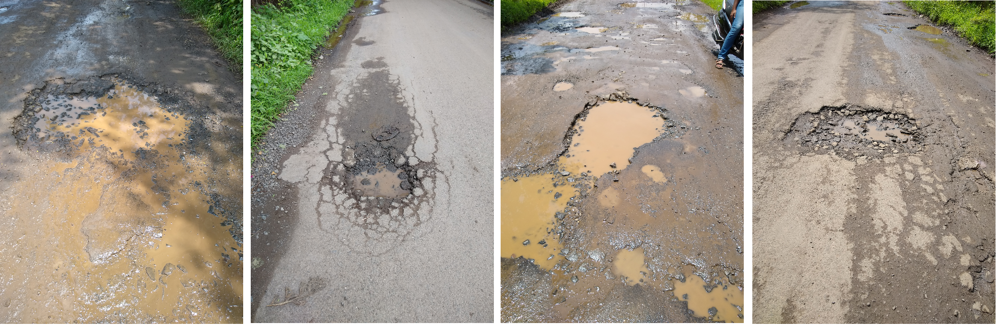
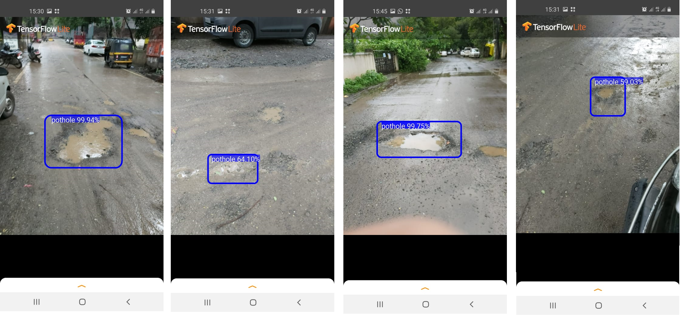

# Pothole Detection Application and Research Paper


## Overview

We propose an efficient and easily scalable approach for the **detection and mapping** of potholes. It as a **Deep Learning** based **two-fold** detection system that uses the **Camera, and, the Accelerometer and Gyroscope** sensors present in our Smartphones. The aim of this project is to **mitigate** the financial and human **losses** incurred every year from accidents caused by potholes by mapping the same and **informing the right authorities**.

[Research Paper](https://ieeexplore.ieee.org/document/9105737)

Team: 
[Aditya Khochare](https://github.com/AdityaPune), [Dheeraj Komandur](https://github.com/dheeraj-komandur), [Shebin Silvister](https://github.com/silvistershebin), [Uday More](https://github.com/udayvmore1), [Shubham Kokate](https://github.com/exalows)

## Introduction

Potholes have been prevalent in places with high population density and poor road management services. Since then, they have been responsible for a huge chunk of road accidents that take place across the globe every year. Our application with its two-fold detection systems minimizes the chances of a pothole going undetected and is easily deployable over a smartphone. 

<p align="center">
   
</p>
<p align="center">Fig. System Workflow</p>

## Implementation

The system we propose utilizes the following two methods of detection:

1. Camera based Detection

The rear camera records a continous stream and sends individual frames to a trained custom object detection model; the Single Shot Multibox detector(SSD). SSDs are designed to support devices with low computational abilities like the Smartphone but perform better than YOLO and CNN. Pothole images are recorded and labelled for the dataset and the TensorFlow object detection API is employed.

Picture here

2. Accelerometer and Gyroscope based Detection

The spikes in Accelerometer and Gyroscope readings when a vehicle passes over a pothole were recorded. We took the Root Mean Square of 10 readings for both the sensors that appeared around the instance in which we passed over a pothole and stored this in our database. These values were used to train a Artificial Neural Network. We used ReLu(Rectifie Linear Unit) as the activation function an Binary cross entropy loss function to measure the performance of our model.

## Datasets

1. Dataset for Camera based detection

We trained our SSD mobile net on more than 135 unique pothole images captured using a 108-megapixel (f/1.7) camera on the Motorola Moto G60 smartphone. The dataset was collected to meet the realistic use case of the project considering various parameters like light sensitivity, angles, shadows, color, distance of pothole from a moving vehicle. The dataset is augmented using traditional image processing algorithms to avoid overfitting and increase dataset size. Potholes in the images were annotated using LabelImg which generated a XML file for each image. Further, details of all images as well as XML files were converted to CSV format and later to TensorFlow RECORD format.

Dataset Link - [Deep Learning Approach to Detect Potholes in Real-Time using Smartphone](https://drive.google.com/drive/folders/1kykyqrIQc1DCKKIaVPAWvmpDUvBVaKHM?usp=sharing)

Below are few examples of the images in our dataset. 




## Citation
If you find the code and datasets useful in your research, please cite:

```
@INPROCEEDINGS{9105737,  
      author={Silvister, Shebin and Komandur, Dheeraj and Kokate, Shubham and Khochare, Aditya and More, Uday and Musale, Vinayak and Joshi, Avadhoot},  
      booktitle={2019 IEEE Pune Section International Conference (PuneCon)},   
      title={Deep Learning Approach to Detect Potholes in Real-Time using Smartphone},   
      year={2019},  volume={},  number={},  pages={1-4},  doi={10.1109/PuneCon46936.2019.9105737}}
```

## Results 



## Conclusion

The deep-learning based system is integrated in and Android Application using Android Studio. It can be used by Road maintainence authorities for inspection and repair, navigation service providers to improve suggestions of the optimum route.

We participated in the **IEEE PuneCon 2019** and our paper was declared as the **Best paper** at the event. 

Event photo here
